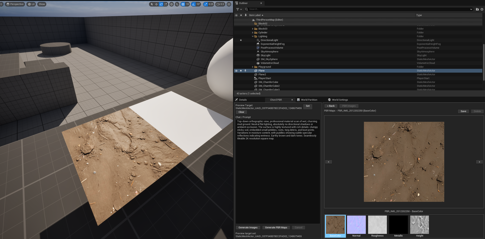

# Chord PBR Generator for Unreal Engine

UE5 Editor plugin to generate PBR materials from text prompts using **ComfyUI** or **Gemini API**.

## 🚀 Quick Start

1. **Prerequisite**: Ensure you can run the **CHORD** workflow in ComfyUI locally.
   *   GitHub: [https://github.com/ubisoft/ComfyUI-Chord](https://github.com/ubisoft/ComfyUI-Chord)
2. **Install**:
   *   **Binary (Recommended)**: Download the release zip, unzip to `Plugins/`, and restart UE5. (No compilation needed)
   *   **Source**: Clone to `Plugins/`, regenerate project files, and compile in Visual Studio.
3. **Enable**: Open UE5, go to **Edit > Plugins**, enable "Chord PBR Generator", and restart.
4. **Open**: Go to **Window > Chord PBR**.

## ⚙️ Configuration

Go to **Project Settings > Plugins > ChordPBRGenerator**:

### 1. Text-to-Image (Choose One)
*   **Local ComfyUI**:
    *   Set `Backend` to **ComfyUI**.
    *   Ensure ComfyUI is running at `http://127.0.0.1:8188`.
*   **Gemini API** (Cloud):
    *   Set `Backend` to **Gemini API**.
    *   Enter your [Gemini API Key](https://aistudio.google.com/).

### 2. PBR Generation
*   Requires **Local ComfyUI** running with the CHORD workflow.
*   Default settings usually work out of the box.

## 🎨 How to Use

1.  **Generate Image**: Type a prompt (e.g., "rusty metal") and click **Generate Images**.
2.  **Generate PBR**: Select an image and click **PBR Images** to create maps (Color, Normal, Roughness, etc.).
3.  **Preview**: Select an actor in the scene and click **Set Preview Target** to see the material live.
4.  **Save**: Click **Save** to import textures and create a Material Instance in your Content Browser.

## ⌨️ Shortcuts
*   **Delete / Backspace**: Delete selected image.

## 📦 Requirements
*   **Unreal Engine**: 5.0 - 5.7
    *   **Binary**: Tested on 5.4.4.
    *   **Source**: Compatible with 5.0+, requires Visual Studio 2022 to compile.
*   **ComfyUI**: Required for PBR generation.

## ⚖️ Disclaimer & Terms of Use

**This plugin is strictly a connector tool.** It does not provide any generation services itself but links your Unreal Engine editor to external services (ComfyUI / Gemini API).

1.  **User Responsibility**: You are solely responsible for deploying, authorizing, and using the backend services (ComfyUI, CHORD workflow, Gemini API).
2.  **CHORD License**: The CHORD workflow is subject to its own license terms (typically **CC BY-NC 4.0** or similar research-only licenses).
    *   **Research Use Only**: If the underlying model/workflow is restricted to research use, you must strictly adhere to that limitation.
    *   **Commercial Use**: Any commercial use or violation of the CHORD license is the sole responsibility of the user.
3.  **API Usage**: By using the Gemini API, you agree to Google's Terms of Service.

**By using this software, you acknowledge that you have read and agreed to these terms.**
